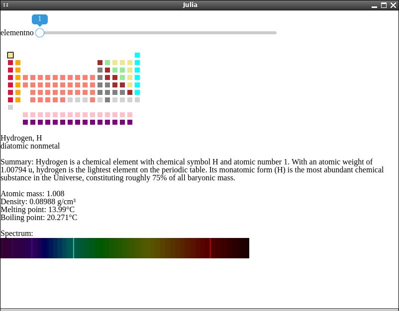
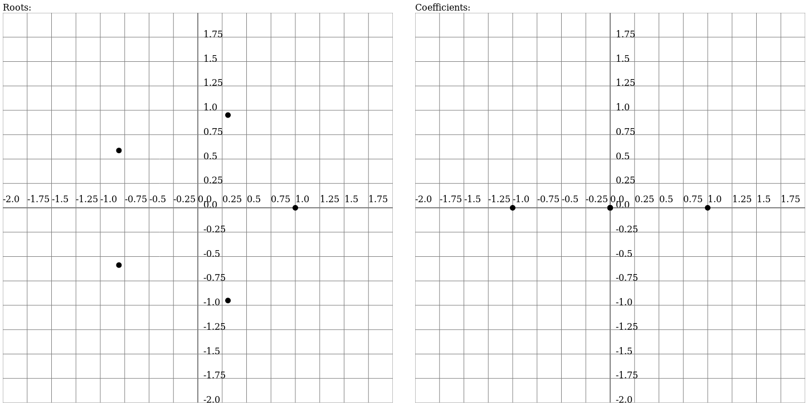
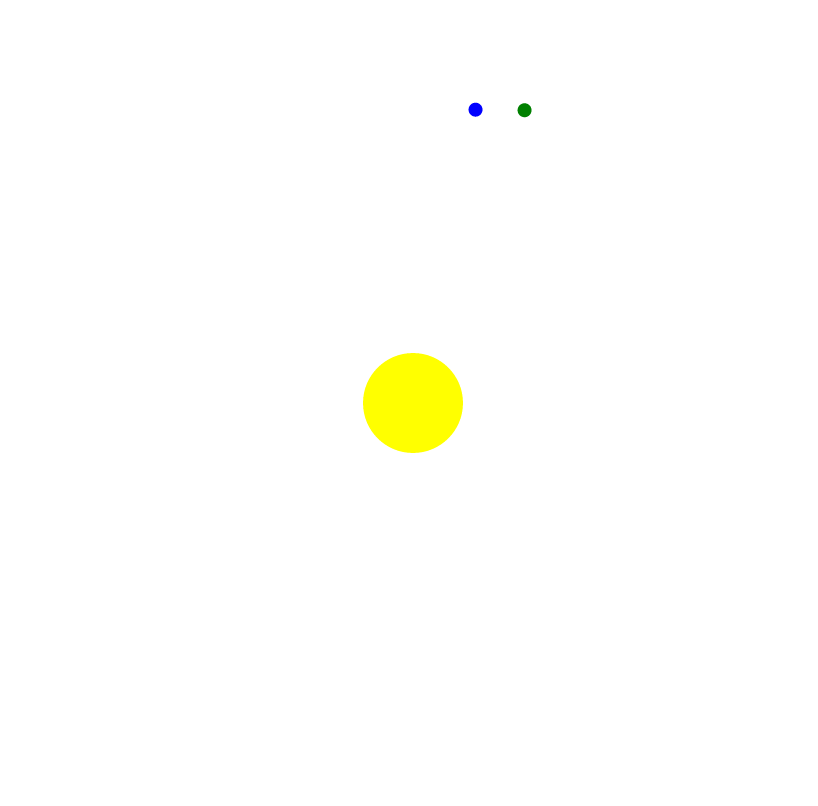
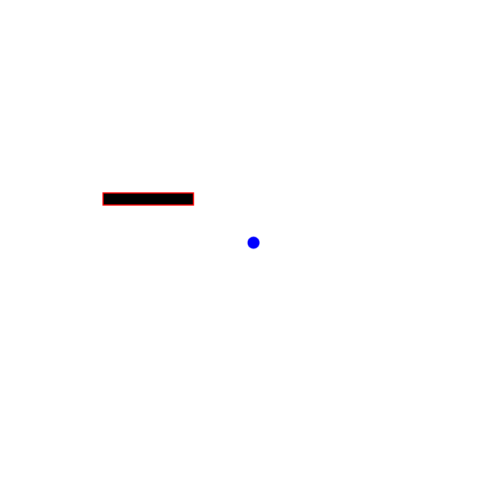
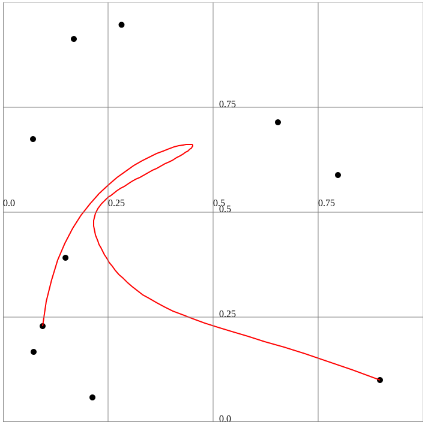
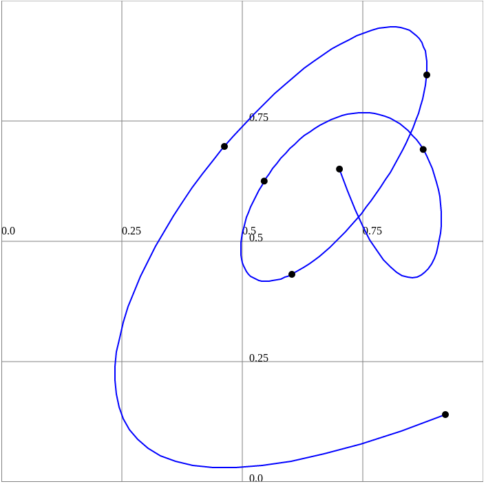

# julia-scripts
various julia scripts

## periodictabletoy.jl
Periodic table demo using [PeriodicTable](https://github.com/rahulkp220/PeriodicTable.jl), [WebIO](https://github.com/JuliaGizmos/WebIO.jl) and [CanvasWebIO](https://github.com/lancebeet/CanvasWebIO.jl) for clickable graphics.

## polynomialstoy.jl
Polynomial roots toy inspired by [Leo C. Stein's](https://duetosymmetry.com/tool/polynomial-roots-toy/). Implemented using Polynomials.jl, [WebIO](https://github.com/JuliaGizmos/WebIO.jl), and [CanvasWebIO](https://github.com/lancebeet/CanvasWebIO.jl).

## orbit.jl

## ball.jl

## bezier.jl

## lagrange.jl

